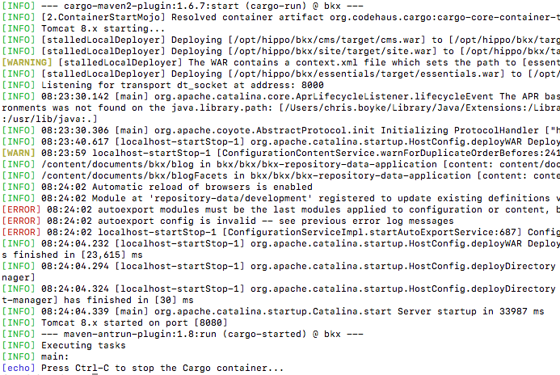
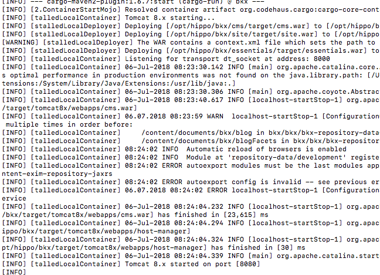

# hippo-log-filter
Format and colorize log output from hippo (BloomReach Experience) to an aid in debugging, etc.

## Usage

mvn -Pcargo.run | hippo_log_filter.py

## Prerequisites

* Python 3
* colorama Python module

## Purpose
Hippo CMS uses a variety of third-party and open-source libraries, which produce log output in different formats.   This makes it difficult to read logs looking for useful error, warning, and debug messages.    Hippo-log-filter reformats and colorizes the output, making it more readable.  

## Example
Here is a screenshot of “filtered” output.  Different log levels are color-coded for easy readability, and timestamp formatting (where present) is simple and consistent:

Here is the same log output unfiltered.   It’s a mess of different formats.  INFO, ERROR, and WARNING lines are all proceeded with an INFO message, date/time formats and spacing are inconsistent.  
See if you can spot the error message below:

